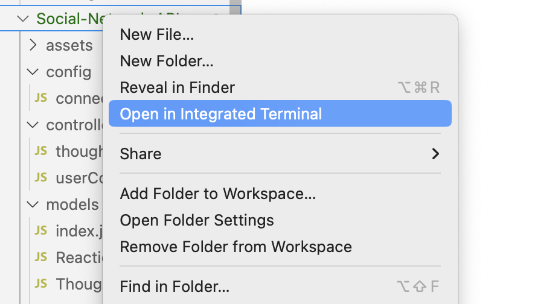

# Social-Network-API

  ## Description
  This project was built to demonstrate my knowledge of manipulating NOSQL databases using Mongoose ODM in Node.js. This backend application has two collections in a social network database, where users can add and delete thoughts, reactions and friends.

  ## Table of Contents
  [Description](#description)

  [Installation](#installation)

  [Usage](#usage)

  [Credits](#credits)

  [Testing](#testing)

  [License](#license)

  [Questions](#questions)

  ## Installation 
  Node.js
  Insomnia

  ## Usage
  To use this application, users must open an integrated terminal in Node.js. Users can then type 'npm start' in the terminal to initialize the app. Users can view the database in MongoDB Compass, and make API requests using insomnia.
  
  To open the terminal:
  

  To initialize the app:
  

  ## Credits
  N/A 

  ## Testing
  N/A

  ## License
  A short and simple permissive license with conditions only requiring preservation of copyright and license notices. Licensed works, modifications, and larger works may be distributed under different terms and without source code.
  [https://opensource.org/license/mit/](https://opensource.org/license/mit/)
  ## Questions
  Please reach out to rileysong01, at [https://github.com/rileysong01](https://github.com/rileysong01) or at rsong47@uwo.ca for additional questions. 
